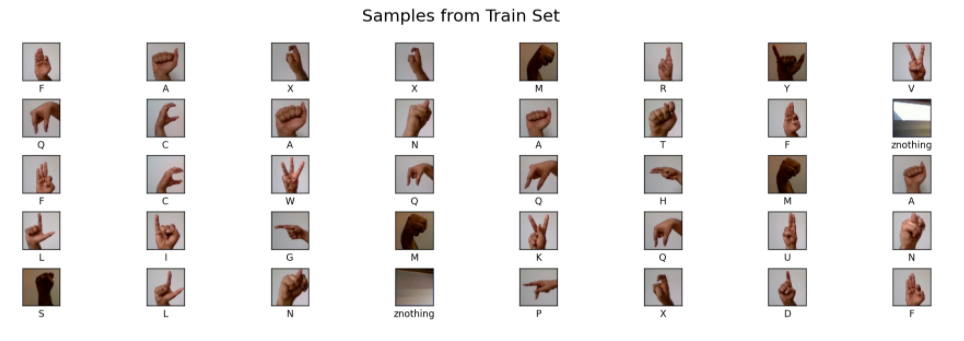

# *Sign Language Recognition*

## Introduction
Sign Language is the language of communication that is used by the deaf people like every other language. With the development of image recognition technology, many studies have appeared on the issue of determining sign language using cameras. In this project, I aimed to use artificial neural networks for real time sign language recognition in digital environment.

## Dataset
The [Sign Language Gesture Images Dataset](https://www.kaggle.com/ahmedkhanak1995/sign-language-gesture-images-dataset) has been used for training our model. The original dataset contained 37 different categories each with 1,500 images. The dataset consists of numbers 0 through 9 and all 26 alphabets in addition to the space sign. in order to lower the computation cost of the training process, I did not train the model for the numbers but only for the characters. for J and Z characters I eliminate them from the dataset since recognition of these characters requires motion detection. moreover, I added the 'Nothing' category to the dataset since there was no such a class in the original one. finally, I end up with 37500 images belong to 25 different classes.  
## The dataset folder should be as in the following image:  
## dataset folder structure
 

## Samples from Test set

## Samples from Train set

## The Architecture of the Used Model

## Results
Traing and Validation loss

Traing and Validation Accuracy

Real-Time Results

Project demo is avaolable [here](https://www.youtube.com/watch?v=6VBk9Me0aqM)
